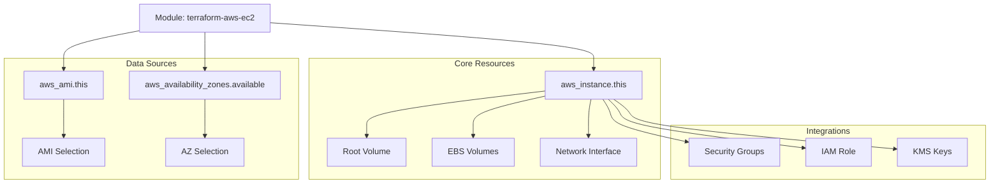

# Terraform AWS EC2 Instance Module

A comprehensive, production-ready Terraform module for creating AWS EC2 instances with best practices built-in.

## Requirements

| Name | Version |
|------|---------|
| terraform | >= 1.13.0 |
| aws | ~> 6.2.0 |
| terragrunt | 0.84.0 |

## Providers

| Name | Version |
|------|---------|
| aws | ~> 6.2.0 |

## Resource Map



## Resources

| Name | Type | Description |
|------|------|-------------|
| [aws_instance.this](https://registry.terraform.io/providers/hashicorp/aws/latest/docs/resources/instance) | resource | Primary EC2 instance with enhanced security defaults |
| [aws_ami.this](https://registry.terraform.io/providers/hashicorp/aws/latest/docs/data-sources/ami) | data source | Automatic AMI selection based on OS preference |
| [aws_availability_zones.available](https://registry.terraform.io/providers/hashicorp/aws/latest/docs/data-sources/availability_zones) | data source | AZ information for region-aware deployment |

## Features

- **Operating System Selection**: Choose from 10+ supported operating systems with automatic AMI discovery
- **Security First**: Encryption enabled by default, IMDSv2 required, configurable security groups
- **Flexible Configuration**: Support for all EC2 instance parameters and block devices
- **Best Practices**: Provider version locking, input validation, comprehensive tagging
- **Production Ready**: Termination protection, monitoring, IAM integration
- **Well Documented**: Complete examples and clear variable descriptions

## Usage

### Basic Example

```hcl
module "ec2_instance" {
  source = "path/to/this/module"

  instance_type = "t3.micro"
  
  # Operating System
  operating_system = "amazon-linux-2"  # or ubuntu-22.04, windows-2022, etc.
  
  # Networking
  subnet_id                   = "subnet-12345678"
  vpc_security_group_ids     = ["sg-12345678"]
  associate_public_ip_address = true

  # Storage
  root_block_device = {
    volume_type = "gp3"
    volume_size = 20
    encrypted   = true
  }

  # Tags
  tags = {
    Name        = "my-instance"
    Environment = "development"
  }
}
```

### Advanced Example

```hcl
module "web_server" {
  source = "path/to/this/module"

  # Instance Configuration
  instance_type               = "t3.medium"
  operating_system           = "ubuntu-22.04"  # Production Ubuntu LTS
  key_name                   = "my-key-pair"
  monitoring                 = true
  ebs_optimized             = true
  disable_api_termination   = true
  iam_instance_profile      = aws_iam_instance_profile.ec2_profile.name

  # Networking
  subnet_id                   = data.aws_subnet.private.id
  vpc_security_group_ids     = [aws_security_group.web.id]
  associate_public_ip_address = false

  # Storage Configuration
  root_block_device = {
    volume_type           = "gp3"
    volume_size          = 30
    encrypted            = true
    kms_key_id          = data.aws_kms_key.ebs.arn
    throughput           = 125
    iops                 = 3000
  }

  ebs_block_device = [
    {
      device_name  = "/dev/sdf"
      volume_type  = "gp3"
      volume_size  = 100
      encrypted    = true
    }
  ]

  # Security Configuration
  metadata_options = {
    http_endpoint = "enabled"
    http_tokens   = "required"
  }

  # User Data
  user_data_base64 = base64encode(file("user_data.sh"))

  # Tags
  tags = {
    Name        = "web-server"
    Environment = "production"
    Application = "webapp"
  }
}
```

## Supported Operating Systems

The module supports automatic AMI discovery for the following operating systems:

| Operating System | Value | AMI Owner | Description |
|------------------|-------|-----------|-------------|
| Amazon Linux 2 | `amazon-linux-2` | Amazon | Default - Stable, well-supported |
| Amazon Linux 2023 | `amazon-linux-2023` | Amazon | Latest Amazon Linux with modern packages |
| Ubuntu 20.04 LTS | `ubuntu-20.04` | Canonical | Long-term support Ubuntu |
| Ubuntu 22.04 LTS | `ubuntu-22.04` | Canonical | Latest LTS Ubuntu |
| Ubuntu 24.04 LTS | `ubuntu-24.04` | Canonical | Newest LTS Ubuntu |
| Red Hat Enterprise Linux 8 | `rhel-8` | Red Hat | Enterprise Linux 8 |
| Red Hat Enterprise Linux 9 | `rhel-9` | Red Hat | Enterprise Linux 9 |
| CentOS 7 | `centos-7` | CentOS | Community Enterprise OS |
| Windows Server 2019 | `windows-2019` | Amazon | Windows Server 2019 |
| Windows Server 2022 | `windows-2022` | Amazon | Latest Windows Server |

**Note**: When `ami_id` is specified, the `operating_system` variable is ignored and the provided AMI is used directly.

## Requirements

| Name | Version |
|------|---------|
| terraform | >= 1.0 |
| aws | ~> 5.0 |

## Providers

| Name | Version |
|------|---------|
| aws | ~> 5.0 |

## Resources

| Name | Type |
|------|------|
| [aws_instance.this](https://registry.terraform.io/providers/hashicorp/aws/latest/docs/resources/instance) | resource |
| [aws_ami.this](https://registry.terraform.io/providers/hashicorp/aws/latest/docs/data-sources/ami) | data source |
| [aws_availability_zones.available](https://registry.terraform.io/providers/hashicorp/aws/latest/docs/data-sources/availability_zones) | data source |

## Inputs

| Name | Description | Type | Default | Required |
|------|-------------|------|---------|:--------:|
| instance_type | The type of instance to start | `string` | n/a | yes |
| operating_system | Operating system for the EC2 instance | `string` | `"amazon-linux-2"` | no |
| ami_id | ID of AMI to use for the instance | `string` | `null` | no |
| ami_owners | List of AMI owners to limit search | `list(string)` | `["amazon"]` | no |
| ami_name_filter | List of AMI name patterns to filter by | `list(string)` | `["amzn2-ami-hvm-*-x86_64-gp2"]` | no |
| key_name | Key name of the Key Pair to use for the instance | `string` | `null` | no |
| monitoring | If true, the launched EC2 instance will have detailed monitoring enabled | `bool` | `false` | no |
| vpc_security_group_ids | A list of security group IDs to associate with | `list(string)` | `[]` | no |
| subnet_id | The VPC Subnet ID to launch in | `string` | `null` | no |
| associate_public_ip_address | Whether to associate a public IP address with an instance in a VPC | `bool` | `null` | no |
| root_block_device | Customize details about the root block device of the instance | `object` | `null` | no |
| ebs_block_device | Additional EBS block devices to attach to the instance | `list(object)` | `[]` | no |
| enable_encryption | Enable encryption for EBS volumes | `bool` | `true` | no |
| tags | A mapping of tags to assign to all resources | `map(string)` | `{}` | no |

For a complete list of variables, see [variables.tf](variables.tf).

## Outputs

| Name | Description |
|------|-------------|
| id | The instance ID |
| arn | The ARN of the instance |
| public_ip | The public IP address assigned to the instance |
| private_ip | The private IP address assigned to the instance |
| public_dns | The public DNS name assigned to the instance |
| private_dns | The private DNS name assigned to the instance |

For a complete list of outputs, see [outputs.tf](outputs.tf).

## Examples

- [Basic Example](examples/basic/) - Simple EC2 instance with minimal configuration
- [Advanced Example](examples/advanced/) - Production-ready instance with IAM, encryption, and monitoring

## Security Considerations

### Default Security Settings

- **Encryption**: EBS volumes are encrypted by default
- **IMDSv2**: Instance metadata service v2 is required by default
- **Termination Protection**: Can be enabled via `disable_api_termination`
- **Security Groups**: Must be explicitly specified (no default security group)

### Best Practices Implemented

1. **Provider Version Locking**: AWS provider version is locked to prevent breaking changes
2. **Input Validation**: Variables include validation rules to prevent misconfigurations
3. **Tagging Strategy**: Comprehensive tagging support for cost management and organization
4. **Least Privilege**: No default IAM permissions (must be explicitly configured)
5. **Encryption**: Storage encryption enabled by default with KMS support

## Testing

### Manual Testing

1. **Basic Validation**:
   ```bash
   terraform init
   terraform validate
   terraform fmt -check
   ```

2. **Plan Review**:
   ```bash
   terraform plan
   ```

3. **Apply and Test**:
   ```bash
   terraform apply
   # Test instance connectivity and functionality
   terraform destroy
   ```

### Automated Testing

Consider using [Terratest](https://terratest.gruntwork.io/) for automated testing:

```go
// Example test structure
func TestTerraformBasicExample(t *testing.T) {
    terraformOptions := &terraform.Options{
        TerraformDir: "../examples/basic",
    }

    defer terraform.Destroy(t, terraformOptions)
    terraform.InitAndApply(t, terraformOptions)

    instanceID := terraform.Output(t, terraformOptions, "instance_id")
    assert.NotEmpty(t, instanceID)
}
```

## CI/CD Integration

### GitHub Actions Example

```yaml
name: Terraform CI/CD

on:
  pull_request:
    branches: [ main ]
  push:
    branches: [ main ]

jobs:
  terraform:
    runs-on: ubuntu-latest
    steps:
    - uses: actions/checkout@v3
    
    - name: Setup Terraform
      uses: hashicorp/setup-terraform@v2
      with:
        terraform_version: 1.5.0
    
    - name: Terraform Format
      run: terraform fmt -check
    
    - name: Terraform Init
      run: terraform init
    
    - name: Terraform Validate
      run: terraform validate
    
    - name: Terraform Plan
      run: terraform plan
      env:
        AWS_ACCESS_KEY_ID: ${{ secrets.AWS_ACCESS_KEY_ID }}
        AWS_SECRET_ACCESS_KEY: ${{ secrets.AWS_SECRET_ACCESS_KEY }}
```

## Contributing

1. Fork the repository
2. Create a feature branch
3. Make your changes
4. Add tests for new functionality
5. Ensure all tests pass
6. Submit a pull request

## License

This module is licensed under the MIT License. See [LICENSE](LICENSE) for details.

## Changelog

See [CHANGELOG.md](CHANGELOG.md) for version history and changes.

## Support

For questions or issues:
1. Check the [examples](examples/) directory
2. Review the [variables.tf](variables.tf) for configuration options
3. Open an issue on GitHub

## Related Resources

- [AWS EC2 Instance Documentation](https://registry.terraform.io/providers/hashicorp/aws/latest/docs/resources/instance)
- [Terraform AWS Provider](https://registry.terraform.io/providers/hashicorp/aws/latest/docs)
- [AWS EC2 Best Practices](https://docs.aws.amazon.com/AWSEC2/latest/UserGuide/ec2-best-practices.html)
